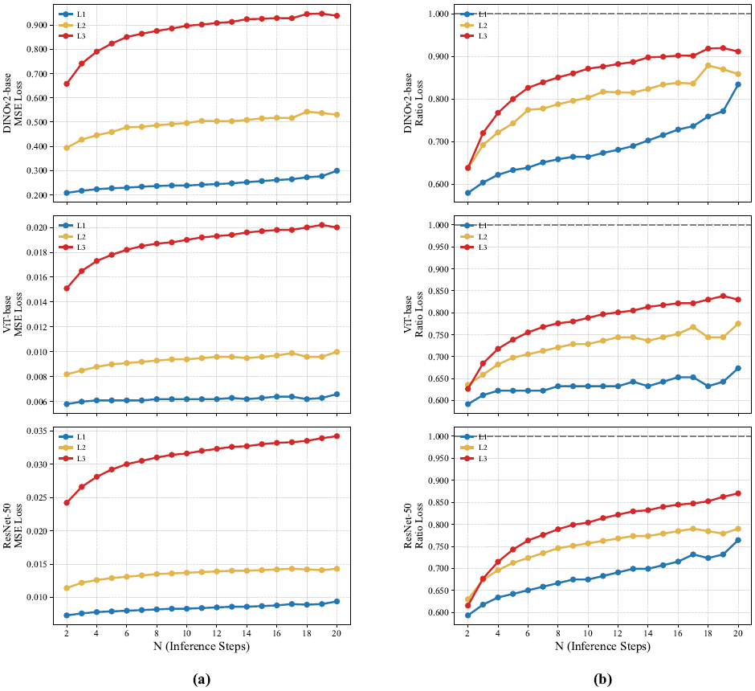
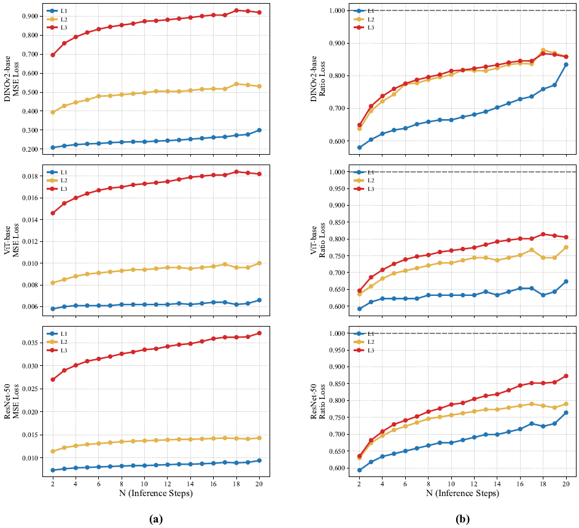
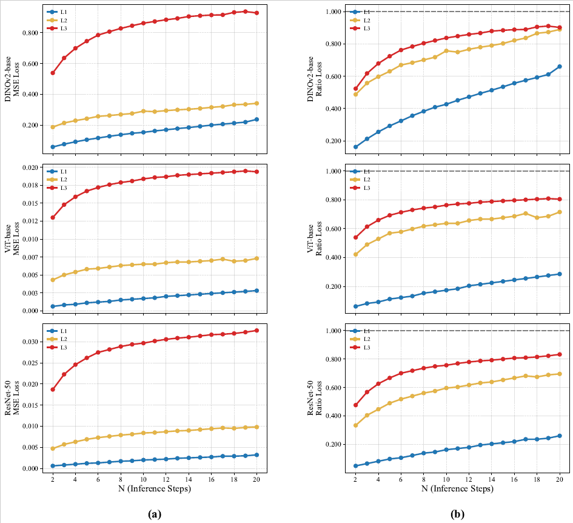
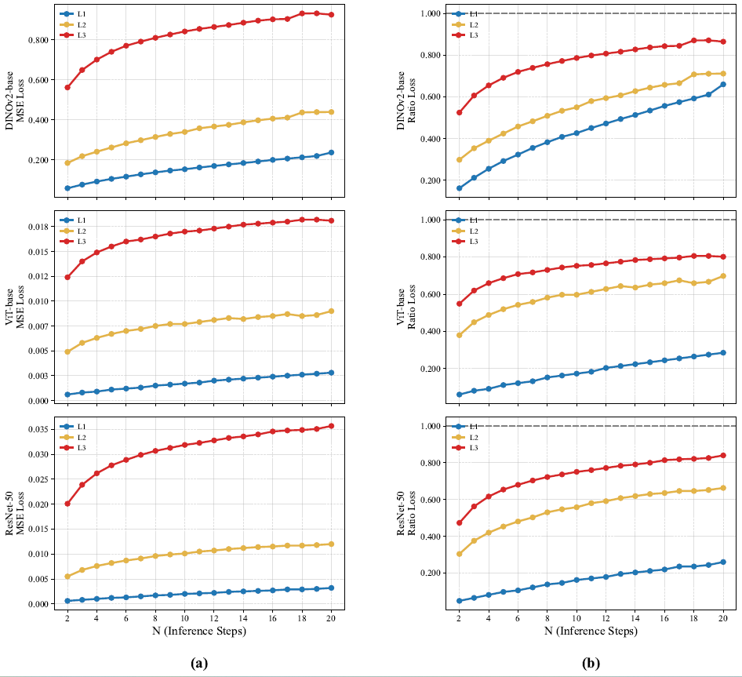

# Rebuttal Figures

**Figure 1. Step 1: Eliminating Level 2 Numerical Drift.**

---

**Figure 2. Step 2: Eliminating Level 3 Scaling for a Strictly Controlled Comparison.**

---

**Figure 3. Step 3: Addressing the Probe Capacity Bottleneck.**

---

**Figure 4. Step 4: The Ultimate Combination and Conclusion.**

